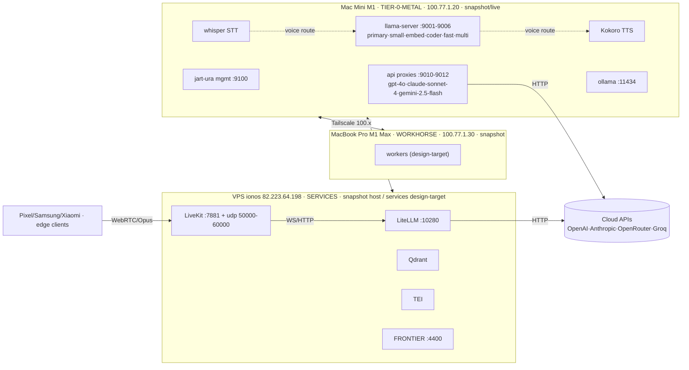

# Jart-URA Control Center — Entity-Relationship Model

- **Status:** DRAFT — Phase 0, for review
- **Date:** 2026-06-15
- **Related:** [`00-ux-spec.md`](00-ux-spec.md) · [`02-open-questions.md`](02-open-questions.md)

The domain model that the map renders. This is the hexagonal **core**: framework- and renderer-agnostic. Every entity carries a `Provenance` value object (see `00-ux-spec.md` §4); nothing in this model is invented — fields the backend does not emit are `null`.

---

## 1. Entities

### Node — a physical machine in the fleet
| Field | Type | Source | Notes |
|-------|------|--------|-------|
| `id` | string | derived | stable id (tailscale hostname) |
| `hostname` | string | registry / snapshot | e.g. `mac-mini-m1` |
| `role` | enum | snapshot / design | `TIER-0-METAL` · `WORKHORSE` · `SERVICES` · `edge` |
| `kind` | enum | snapshot | `mac` · `linux-vps` · `android` |
| `tailscaleIp` | string | snapshot | `100.x` |
| `lanIp` | string\|null | snapshot | |
| `os`, `arch` | string\|null | snapshot | |
| `status` | enum | health/reachability | `online` · `offline` · `unknown` |
| `provenance` | Provenance | — | freshness + level |

### HardwareComponent — a part inside a node
| Field | Type | Source | Notes |
|-------|------|--------|-------|
| `id` | string | derived | |
| `nodeId` | string | — | FK → Node |
| `type` | enum | snapshot | `CPU` · `RAM` · `ANE_NPU` · `GPU_METAL` · `DISK` · `NIC` |
| `label` | string | snapshot | |
| `metrics` | {util%, used, total}\|null | planned | `—` until exposed |
| `status` | enum | derived | `ok` · `hot` · `unknown` |

### Service — a process/daemon hosted on a node
| Field | Type | Source | Notes |
|-------|------|--------|-------|
| `id` | string | derived | |
| `nodeId` | string | — | FK → Node |
| `name` | string | snapshot/design | `jart-ura-mgmt`, `llama-server`, `ollama`, `lmstudio`, `whisper-stt`, `kokoro-tts`, `home-assistant`, `litellm`, `postgres`, `vllm`, `qdrant`, `tei`, `livekit`, `frontier-bench` |
| `port` | number\|null | snapshot/config | |
| `protocol` | enum | derived | see Channel.protocol |
| `status` | enum | health | `running` · `stopped` · `unknown` |
| `provenance` | Provenance | — | many `SERVICES` items are `design-target` |

### Model — an inference endpoint managed by Jart-URA
Normalised from `/v1/registry` by `src/lib/api.js → mapRegistryEntry` (treated as correct).
| Field | Type | Source |
|-------|------|--------|
| `name` | string | registry |
| `node` / `hostname` | string | registry |
| `source` | `local` \| `api` | registry |
| `port` | number | registry |
| `status` | `running`·`degraded`·`failed`·`stopped` | registry/health |
| `type` | `chat` \| `embedding` | registry |
| `provider` | string\|null | registry (api) |
| `engine` | string\|null | config (local: `metal`/`coreml`/`planar3`) |
| `model` | string | registry (`api_model`) / config (`model_path`) |
| `caps` | {vision, fnCall} | registry |
| `context`, `maxTokens` | number\|null | config / registry |
| `tailscaleAddr` | string | registry |
| `metrics` | {tps,p50,p95,p99,loadPct,reqActive,reqTotal,uptime} \| null | planned `/v1/health/full` |
| `pid`, `restarts`, `lastRestart`, `logPath` | … \| null | planned |
| `cert`, `benchSource` | … \| null | FRONTIER `:4400` |
| `servedBy` | string | — | FK → Service (the `llama-server` or proxy) |

### Slot — a pipeline stage (design-target)
`VAD · STT · ROUTER · LLM · TTS · VISION · EMBEDDINGS`. A slot is *filled by* a Model at runtime.
| Field | Type | Source |
|-------|------|--------|
| `id` | enum | design |
| `boundModelId` | string\|null | routing |
| `provenance` | Provenance | `design-target` until live routing exists |

### Channel — a network link, identified by protocol
| Field | Type | Source |
|-------|------|--------|
| `id` | string | derived |
| `fromId`, `toId` | string | — | endpoints (Node·Service·Model·Client) |
| `protocol` | enum | derived | `HTTP`·`WS`·`WEBRTC`·`TAILSCALE`·`SSH`·`OLLAMA`·`SMB`·`VNC` |
| `ports` | number[] | snapshot/config |
| `status` | enum | derived | `idle`·`active`·`down` |
| `directionality` | enum | — | `uni` · `bi` |

### Route — an ordered logical flow over channels
| Field | Type | Source |
|-------|------|--------|
| `id` | enum | design + live |
| `name` | string | — | `chat` · `mesh-poll` · `voice` · `cloud` |
| `hops` | Hop[] | — | ordered |
| `direction` | enum | — | `forward` · `return` · `both` |
| `status` | enum | live | `idle` · `tracing` · `active` |

**Hop** = `{ channelId, throughComponentIds[], throughServiceId }` — what a segment physically traverses (so illumination can name "this, here").

### RoutingDecision — live routing fact
`{ routeId, chosen: 'local'|'cloud', modelId, costLayer: 'flat'|'ppu'|'backup', at }`. Drives which path is lit as **active**.

### Provenance — value object on every entity
`{ level: 'live'|'configured'|'snapshot'|'design-target', source, observedAt }`.

## 2. Relationships & cardinalities

```
Node 1───* HardwareComponent
Node 1───* Service
Node 1───* Model            (by hostname)
Service 1───* Model         (a llama-server / proxy serves models)   Model *───1 Service (servedBy)
Node *───* Node             via Channel (Tailscale mesh / peers[])
Channel *───2 Endpoint      (Endpoint = Node | Service | Model | Client)
Route 1───* Hop             Hop *───1 Channel
Slot 0..1───1 Model         (boundModelId at runtime)
RoutingDecision *───1 Route
RoutingDecision *───1 Model
Provenance 1───1 <every entity>
```

## 3. State machines

```
Node.status:     unknown ──reachable──> online ⇄ offline ──timeout──> unknown
Model.status:    stopped ⇄ running ⇄ degraded ──crash──> failed ──restart──> running
Channel.status:  idle ⇄ active ──loss──> down ──recover──> idle
Route.status:    idle ──select──> tracing ──live traffic──> active ──end──> idle
```

Illumination is a pure function of these states + `RoutingDecision`. The map never animates a path that is not `active`/`tracing` in reality.

## 4. Schema diagram (mermaid)

```mermaid
erDiagram
  NODE ||--o{ HARDWARE_COMPONENT : has
  NODE ||--o{ SERVICE : hosts
  NODE ||--o{ MODEL : "serves (hostname)"
  SERVICE ||--o{ MODEL : "servedBy"
  NODE }o--o{ NODE : "mesh (Tailscale)"
  CHANNEL }o--|| NODE : connects
  ROUTE ||--o{ HOP : "ordered"
  HOP }o--|| CHANNEL : traverses
  SLOT |o--|| MODEL : "bound to"
  ROUTING_DECISION }o--|| ROUTE : chooses
  ROUTING_DECISION }o--|| MODEL : routes-to
  NODE { string hostname; enum role; enum status; Provenance prov }
  MODEL { string name; enum source; enum status; int port }
  SERVICE { string name; int port; enum status }
  CHANNEL { enum protocol; enum status; enum directionality }
  ROUTE { string name; enum status; enum direction }
```

## 5. Concrete fleet (verified vs design-target)



The dashed `voice route` (STT → LLM → TTS) is the signature path to illuminate. Solid edges are channels coloured by protocol at render time. `WORKHORSE` workers and most `SERVICES` are `design-target` until verified live — they render ghosted (see `00-ux-spec.md` §4).

## 6. Mapping to live sources

| Domain entity | Primary source | Endpoint | Provenance |
|---------------|----------------|----------|------------|
| Model (+status, caps, ports) | Jart-URA registry | `GET :9100/v1/registry` → `unified[]` | `live` |
| Model metrics (tps, p50/95/99, load) | planned | `GET :9100/v1/health/full` | `—` today |
| Model certification | FRONTIER BENCH | `:4400` | `—` today |
| Node aggregate health | Jart-URA | `GET :9100/health` | `live` |
| Node hardware / OS / IPs | Tailscale + host snapshot | offline snapshot | `snapshot` |
| Mesh peers | config + registry | `config peers[]` (empty) + registry `peers[]` | `configured`/`live` |
| SERVICES topology | `ARCHITECTURE.md` | doc | `design-target` |
